<p align="center">
  
</p>

<p align="center">
  <a href="https://apps.microsoft.com/detail/9N7XNDD5WRGS"></a>
  <a href="https://github.com/pycode4micro/cardbush/releases"></a>
  <a href="https://github.com/pycode4micro/cardbush/stargazers"></a>
  <a href="https://github.com/pycode4micro"></a>
</p>

<p align="center"><a href="README.md">English</a> · <strong>简体中文</strong> · <a href="#文档导航">文档导航</a> · <a href="https://github.com/pycode4micro/cardbush/issues">问题反馈</a></p>

# CardBush

**让对话变成行动的个人 AI 工作区。** 用文字或语音交流，处理文件和浏览器任务，编排自己的初始桌面，在本机或独立 Agent 服务上持续工作。

选择适合自己的模型，通过 MCP 和技能接入工具，在同一界面管理本地与远端任务。核心本地对话和命令工具不需要额外启动服务器或安装 Python。

如果 CardBush 对你有帮助，欢迎 **[点一个 Star](https://github.com/pycode4micro/cardbush/stargazers)**，或 **[关注 @pycode4micro](https://github.com/pycode4micro)** 了解开发进展。也欢迎提交问题、想法和代码。

## 下载

| 系统 | 下载 | 适用电脑 |
| --- | --- | --- |
| **Windows 11** | **[从 Microsoft Store 下载 CardBush（MSIX）](https://apps.microsoft.com/detail/9N7XNDD5WRGS)** | Intel / AMD x64；build 22000 起 |
| Linux | [从 Releases 下载 AppImage](https://github.com/pycode4micro/cardbush/releases) | x86-64 桌面 Linux；CI 使用 Ubuntu 22.04 验证 |

[全部版本与 SHA-256 校验文件](https://github.com/pycode4micro/cardbush/releases) · [构建与验证流程](https://github.com/pycode4micro/cardbush/actions/workflows/desktop.yml)

本文介绍源码版本 **1.0.0-beta.5** 的能力。实际可下载的版本以商店和 Releases 页面为准，可能尚未包含主分支的全部更新。MSIX 使用独立的四段版本号。目前不提供 macOS、ARM64 或 32 位安装包。

### 安装与开始使用

**Windows：** 打开 [Microsoft Store 商店页](https://apps.microsoft.com/detail/9N7XNDD5WRGS)，安装后从开始菜单启动 CardBush。Windows 负责管理 MSIX 包及更新。卸载前请备份需要保留的对话和设置；正常 MSIX 卸载会清理包所属数据。

**Linux：** 下载已发布的 x86-64 AppImage，重命名为 `CardBush.AppImage`，赋予执行权限后启动：

```sh
chmod +x CardBush.AppImage
./CardBush.AppImage
```

AppImage 需要 FUSE 2（Ubuntu 22.04 可运行 `sudo apt install libfuse2`）。没有 FUSE 时可使用 `APPIMAGE_EXTRACT_AND_RUN=1` 启动。Chromium 需要正常的沙箱环境，不建议通过关闭沙箱解决安装问题。

首次启动后，打开 **应用中心 → 设置 → 模型管理 → 添加模型**：

- **API Key 接入：** 配置服务商，选择 OpenAI Responses、Chat Completions 或 Anthropic Messages；支持 OpenRouter、OpenCode Go。详见[模型接入说明](docs/MODEL_CONNECTIONS.md)。
- **ChatGPT 账号接入：** 在本机选择 **ChatGPT · SIWC → Continue with ChatGPT**，在系统浏览器完成授权，再从账号返回的列表中选模型。能否使用取决于账号与服务端权限；本机账号凭据不会同步到远端 Agent。详见 [SIWC 接入与限制](docs/SIWC_INTEGRATION.md)。

设置页顶部可选择本机或已连接的 Agent。模型用量按所选服务商或已授权套餐计算，插件可能需要单独的依赖或凭证。

## 主要功能

| 方向 | 可以做什么 |
| --- | --- |
| **文字与语音** | 流式回复、图片附件、消息排队与运行中引导。输入框为空时，单击麦克风录音转文字，长按进入会朗读 Agent 回复的语音通话。 |
| **自己的初始桌面** | 编排时钟、日历、对话引导及两种输入框；导入自定义 HTML 组件，拖拽、缩放、辅助线吸附，通过事件和已授权动作交互，并自动跟随主题。 |
| **浏览器工作区** | 收藏常用页面，使用多页面 Beta，展开右侧内容区并通过浮动的返回／输入胶囊继续交流。 |
| **执行任务的工具** | 搜索和编辑文件、执行命令、调度子 Agent、安装 MCP 插件与技能、安排自动化；支持申请批准与完全访问。 |
| **本地与远端** | 内置 Agent、SSH 项目、独立 Agent 服务；个人 Linux Agent 可选独立图形桌面、Computer Use 和 Browser Use。 |
| **连续的工作上下文** | 会话持久化、上下文恢复、归档工具结果检索和使用记录；习惯记忆与下一步预测可选，默认关闭。 |

语音采用语音识别、现有文字 Agent 和语音合成串联，只有语音通话自动朗读回复。**本地识别推荐 SenseVoice，主要播报模型为 Qwen3-TTS CustomVoice**，男女声音色可独立设置，使用正常语速。模型可选安装、不会预装；Qwen 通过选择本地模型目录和 Python 环境接入，Windows 语音及旧版 Kokoro 仍可选用。Windows x64 还提供可选本地声纹锁定，录入后验证说话人，减少旁人讲话触发发送或打断播报。详见[本地语音安装、下载与平台限制](docs/LOCAL_VOICE_MODELS.md)。

通过 **应用中心 → 组件** 编辑新会话页面。系统内置组件定义始终保留；自定义 HTML 在隔离框架中运行，动作需明确授权。日历通过悬浮展示节日和自动化详情。详见[组件、布局与多页面说明](docs/HTML_COMPONENTS_V1_2026-09-30.md)。

通过 **Agents → +** 接入独立服务。服务拥有自己的模型配置、凭据、项目、插件和任务队列，桌面断开后已接收的任务仍可继续。**SSH 项目**则由桌面运行 Agent，将支持的文件和命令操作交给指定 SSH 主机。详见[独立 Agent 服务](docs/AGENT_SERVICES.md)与 [SSH 工作区](docs/SSH_WORKSPACES.md)。

远端部署**默认无图形桌面**。可选的 [Docker 桌面配置](deploy/agent/README.md)为个人 Agent 增加独立 Linux 桌面、可见 Chromium 浏览器、桌面预览与用户接管；普通服务化部署无需开启。

应用中心只显示实际可打开的页面和用户选择的应用；普通 MCP 连接仍在插件设置中管理。`@` 引用向 Agent 提供应用上下文，不代表已经执行或授予权限。详见[应用中心说明](assets/skills/cardbush-docs/references/app-center.md)。

Team 工作流作为独立插件安装，不包含在桌面安装包中，详见 [Team 插件架构](docs/TEAM_PLUGIN_EXTRACTION.md)。

### 平台能力

| 桌面应用能力 | Windows x64 | Linux x64 |
| --- | --- | --- |
| 对话、文件、预览、MCP、内置浏览器 | 支持 | 支持 |
| 终端命令 | PowerShell / cmd | POSIX Shell |
| 随包文件搜索 | Windows ripgrep | Linux ripgrep |
| 命令沙盒 | AppContainer | bubblewrap，需宿主环境支持 |
| Windows 电脑操控插件 | 支持 | 不可用 |
| Browser Use（Chrome / Edge） | 支持 | 不可用，仍可使用内置浏览器 |
| 进程 CPU / 内存原生限制 | Windows Job Objects | 尚未实现 |
| 托管进程准入与所属进程清理 | 支持 | 支持 |

Windows Browser Use 连接器与远端 Linux 桌面使用不同实现。Docker 桌面配置提供的是服务器上的 Linux Computer Use / Browser Use，不会使 Windows 专属插件变成跨平台插件。本地语音的平台范围见[语音指南](docs/LOCAL_VOICE_MODELS.md)。

Linux 的 CPU／内存限制尚未与 Windows 完全一致。外部插件是独立程序，各自的平台要求仍需满足。远端服务提供自身主机的能力，不继承连接它的桌面能力。

沙盒设置先检测环境，需要安装依赖时由用户点击。已安装且可用的沙盒默认启用，用户或管理员显式关闭的设置会保留。通常的 `auto` 策略下，**申请批准**隔离命令并在需要时申请额外权限，**完全访问**使用普通进程；管理员设定的 `required` 策略在两档模式下均有效。命令沙盒不覆盖全部 MCP、插件和浏览器行为。详见[权限说明](docs/PERMISSIONS.md)及[沙盒范围与限制](docs/EXECUTION_SANDBOX.md)。

## 文档导航

| 想了解什么 | 文档 |
| --- | --- |
| 接入模型 | [服务商、协议与 OpenRouter](docs/MODEL_CONNECTIONS.md) · [ChatGPT / SIWC](docs/SIWC_INTEGRATION.md) |
| 配置语音 | [本地识别与朗读模型](docs/LOCAL_VOICE_MODELS.md) |
| 自定义工作区 | [HTML 组件、布局与多页面](docs/HTML_COMPONENTS_V1_2026-09-30.md) · [应用中心](assets/skills/cardbush-docs/references/app-center.md) |
| 部署远端 Agent | [服务部署](docs/AGENT_SERVICES.md) · [Docker 与可选 Linux 桌面](deploy/agent/README.md) · [SSH 项目](docs/SSH_WORKSPACES.md) |
| 了解权限 | [权限说明](docs/PERMISSIONS.md) · [命令沙盒](docs/EXECUTION_SANDBOX.md) · [Computer Use / Browser Use](docs/CORE_BROWSER_COMPUTER_USE.md) |
| 参与开发与发布 | [架构](docs/ARCHITECTURE.md) · [跨平台发布](docs/CROSS_PLATFORM_RELEASE.md) · [MSIX 维护指南](docs/MSIX_STORE_RELEASE.md) |

## 开发与打包

需要 Node.js **>=22.12**、npm **>=10**；CI 使用 Node.js 24。安装程序在对应操作系统上构建。

```sh
npm ci
npm run runtime-tools:install
npm run dev
```

```sh
npm run build
npm run typecheck
npm run test:release
npm run package:msix    # 在 Windows 生成商店包，需先按 MSIX 维护指南配置
npm run package:win     # 在 Windows 生成签名 NSIS 安装程序，需要发布者证书
npm run package:linux   # 在 Linux 生成 AppImage
npm run smoke:packaged
```

无桌面的 Linux 可使用 `xvfb-run -a npm run test:release`。产物位于 `release/`。运行 `test:release` 前先构建；它覆盖包测试、对抗场景、平台约束和 Electron 界面测试，避免为每个测试重复构建。更广的功能专项检查可运行 `npm run test:all`。模型协议测试使用本地模拟 HTTP 服务，不需要真实 API 密钥。

无图形界面的 Agent 服务使用 `npm ci --ignore-scripts`、`npm run build:agent` 构建，然后运行 `node dist-electron/agentServiceCli.mjs --data-dir /absolute/path/agent-data`。服务由 Node.js 运行，不启动 Electron。使用独立数据目录，并按[部署指南](docs/AGENT_SERVICES.md)配置鉴权及 SSH / HTTPS 接入；容器和可选图形桌面见 [Docker 指南](deploy/agent/README.md)。更新桌面安装包不会部署或更新这个服务。

Electron 默认从官方源下载，网络需要时可设置 `ELECTRON_MIRROR`。下载不完整时运行 `npm run fix:electron` 修复。

## 架构与维护

| 目录 | 职责 |
| --- | --- |
| `packages/cardbush-platform` | 平台能力、Shell 解析、可执行文件查找、原生资源路径 |
| `packages/bush-runtime` | 与模型厂商无关的 Agent 循环、工具、权限和状态 |
| `packages/bush-product-agent` | 共用的产品指令与回合请求构造 |
| `packages/cardbush-product-host` | 模型、插件、MCP、沙盒和维护的共享命令约定及配置 |
| `packages/bush-protocol` | 命令、事件与 IPC 类型约定 |
| `packages/bush-provider-openai` | Responses、Chat Completions 和 Anthropic Messages 模型传输 |
| `packages/bush-mcp-client` | MCP 传输及工具／资源接入 |
| `packages/bush-runtime-electron` | 桌面与 Node 宿主共用的类型化 Runtime 传输和客户端 |
| `electron` | 桌面生命周期、Utility Runtime 宿主、无界面 Agent 服务与宿主适配 |
| `src` | 共用的 React 对话／设置界面及本地／远端适配 |
| `scripts` | 开发、回归测试、打包和启动检查 |

平台选择集中在 `@cardbush/platform`，浏览器可用的类型约定与 Node 适配分别导出。桌面在 Electron utility process 中托管 Runtime，独立服务由 Node.js 托管同一个 worker。Product Host 与后端适配决定配置和操作所属的环境，对话界面消费共用的 Runtime 事件，不再维护另一套云端消息投影。

详见[当前架构](docs/ARCHITECTURE.md)、[跨平台维护与发布指南](docs/CROSS_PLATFORM_RELEASE.md)、[工具交互约定](docs/TOOL_INTERACTION.md)和 [内置 Apps MCP](docs/host/CARDBUSH_APPS_MCP.md)。

## 数据与安全

本地对话、使用记录和设置保存在 Electron 用户数据目录。每个独立 Agent 将自身数据和凭据保存在服务器的数据目录，切换环境不会自动复制到另一台主机。本地自动化依赖桌面应用运行；独立 Agent 的队列及其支持的自动化在服务运行期间执行。清理临时缓存不会重置已经记录的使用量。

界面启用上下文隔离，不直接访问 Node.js。远端接入需鉴权，访问令牌代表整个实例的访问权限，当前不是多租户账号系统。模型服务和外部插件会接收完成所请求操作需要的数据。文件／工具权限与操作系统命令隔离属于不同控制层。

提交公开问题时，请移除密钥、原始对话数据和日志中的敏感信息。

## 开源协议

CardBush 原创代码使用 [Apache License 2.0](LICENSE)，另见 [NOTICE](NOTICE) 与[内置技能许可证](docs/BUNDLED_SKILL_LICENSES.md)。随包依赖、技能及外部插件保留各自的许可证。
