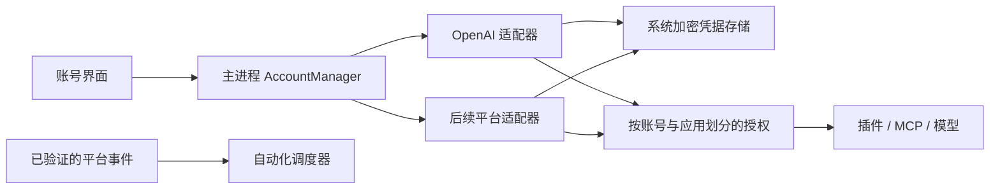

# 账号中心与多平台接入研究

核验日期：2026-09-09。本文区分本轮实现、官方文档所确认的能力和后续设计建议。

## 本轮实现

插件页导航为「插件 / 技能 / 市场 / 账号」。原首页 OpenAI 横条迁入「账号」页；插件详情保留状态和「管理账号」入口，并支持返回原插件。未保存连接配置时不允许通过该入口离开，避免丢失私密表单输入。

账号页提供平台搜索、登录状态、登录、取消登录、重新登录、应用连接刷新、管理授权和退出。仅 OpenAI 已接入；Claude、QQ、微信、bilibili 明确显示「待接入」，提供用途和官方说明，不创建假的登录流程。

新 `AccountManager` 由主进程持有，按 `providerId + accountId` 分派操作。平台适配器负责列出账号与执行支持的操作；公共快照不接收 token、Cookie、API Key 或客户端密钥字段，一个适配器读取失败不会隐藏其他平台。UI 的取消、新登录、页面卸载和并发读取带有版本隔离，旧请求不能覆盖较新的登录状态。

OpenAI 适配器继续使用原 `OpenAiAccount` 及 `mcp-oauth.bin` 加密存储，没有迁移或复制令牌；原有插件连接也无需重新配置。旧的 OpenAI IPC 继续兼容，和新账号入口调用同一执行函数。当前 OpenAI 仍只有一个活动账号槽 `openai:default`，重新登录会替换该槽的身份；通用接口支持按账号 ID 分派，但本轮没有实现 OpenAI 多账号并存。

## 平台研究

| 平台 | 官方能力与接入依据 | CardBush 推荐路线 | 当前限制 |
| --- | --- | --- | --- |
| OpenAI | Codex 官方区分 ChatGPT 登录和 API Key 登录，两者对应不同使用和计费范围。[认证文档](https://learn.chatgpt.com/docs/auth) | 先集中管理当前用于托管应用的账号；模型凭据仍走模型配置。 | CardBush 当前复用公开客户端 OAuth 注册信息的托管连接属于实验性实现；官方 Codex 文档不能作为 CardBush 获得通用第三方登录资格或所有应用访问权的证明。 |
| Claude | 官方面向第三方产品建议使用 Claude Console API Key 或受支持云平台；订阅登录与 API 调用需要分别处理。[账号与第三方使用说明](https://support.claude.com/en/articles/13189465-log-in-to-your-claude-account)、[API 认证](https://platform.claude.com/docs/en/manage-claude/authentication) | 首先支持 API 凭据与对应模型适配，再评估正式开放给第三方的账号方式。 | 账号页还没有 Claude 凭据适配器；保存一个 Key 本身也不能替代 Claude 模型请求协议适配。不从 Claude Code 提取订阅凭据来冒充其客户端。 |
| QQ | 腾讯官方账号接入文档要求注册应用、取得 App ID/App Key 并配置网站回调，身份映射包含 openid/unionid。[腾讯 OneID 的 QQ 登录说明](https://cloud.tencent.com/document/product/1441/62653) | 将 QQ 互联身份登录作为独立适配器；机器人或消息功能使用对应能力和连接授权。 | 本轮 QQ 互联原站正文抓取失败，采用腾讯官方产品文档交叉核验。应用资格、回调形式及实际开放权限须在 CardBush 申请时确认。不能从身份登录推断可以访问个人聊天。 |
| 微信 | 腾讯 CloudBase 官方文档确认微信开放平台登录需要注册应用、AppId/AppSecret、重定向和状态校验，可同步用户身份资料。[微信授权登录](https://docs.cloudbase.net/authentication-v2/method/wechat-login) | 微信开放平台身份、公众号、小程序、企业微信分别建模，再按具体目标选择接入方式。 | 本轮微信原始开发文档抓取失败，以上用腾讯官方文档核验登录链路。这里没有验证个人微信聊天收发接口；不会用扫码登录成功冒充消息权限。 |
| bilibili | 官方开放平台列出账号授权、公开用户信息、视频管理、数据开放和 Webhooks；入驻流程包括身份审核和应用接入。[文档目录](https://open.bilibili.com/doc)、[平台入口](https://open.bilibili.com/) | 优先正式创作者授权与内容能力，随后把已授权的事件通知接入自动化。 | 文档为动态站点，本轮确认到官方目录及入驻说明，具体 scope、刷新、撤销和 Webhook 签名协议仍需逐页核验、申请及沙盒验证。尚未实现该平台登录。 |

上述是按用途选择接入方式的工程判断，不代表这些平台给 CardBush 开放了全部列出的能力，也不承诺第三方平台的审核结果。

## 推荐的数据边界

账号中心应统一管理体验，平台协议继续由各自适配器实现，不要求它们采用相同 OAuth 端点或相同凭据格式。

后续建议明确四种记录，避免把“已登录”当成所有功能都可用：

- **平台定义**：稳定 provider ID、支持的认证方式、用途、实际实现状态、对应适配器。
- **账号身份**：CardBush 的稳定账号 ID、平台侧 subject、昵称/头像、组织或工作区。身份资料只来自已验证的认证结果，不根据邮箱或显示名自动合并账号。
- **授权记录**：绑定账号、客户端应用、资源地址、scope、有效期和状态。OpenAI 账号登录与 Slack 工作区授权是两条不同记录；停用一个连接不应退出共享账号。
- **使用绑定**：插件连接、模型配置、自动化分别选择账号与授权 ID。多账号接入后，替换或删除被使用的账号需要先展示影响的连接；不默认把旧任务悄悄改到另一个账号。

前三项中，本轮已经实现平台目录和账号操作边界；平台侧资料、多份授权索引及多账号使用绑定尚未实现。未来完善后，应让 UI 显示账号具体用途、授权范围、失效原因和受影响连接，再考虑统一“添加账号”向导。

## 认证方式与凭据

原生应用 OAuth 优先系统浏览器和授权码流程；在提供方支持的条件下采用 PKCE，以及其正式允许的 loopback 或应用回调方式。客户端安装包无法可靠保守一个分发给所有人的共享 secret；若提供方要求机密客户端，应选择受控服务端交换，或另行设计用户自有应用配置，不把公共 AppSecret 打进 Electron。依据：[RFC 8252](https://www.rfc-editor.org/rfc/rfc8252.html#section-8.5)。

这不意味着现在必须建设统一云端账号服务。当前本机账号管理可以保留；每接入一个平台，再依据应用注册和回调要求决定是否需要一个最小授权中转服务。中转只负责该授权链路，不会因为用户登录账号就获得所有平台能力。

网页 Cookie 会话应是另一种受限的浏览器能力：即使未来支持，也应留在隔离的浏览器配置中，只向获准的浏览器操作开放。本轮不收集 Cookie、不自动读取现有浏览器登录态，也不把“网页登录成功”记成“API 已授权”。API Key 则由主进程私密表单录入并绑定到明确的服务；不通过聊天或普通配置字段传递。

新增适配器仍需实现自己的刷新合并、取消、超时、登录替换隔离和安全错误信息。账号页的退出当前表示删除本机凭据；只有完成平台撤销接口调用后，才可以显示“服务端授权已撤销”。

## 与 Hooks、定时任务的关系

账号登录只是事件接入的前置条件。将 Bilibili 等平台的 Webhook 接入自动化，还需要事件订阅、回调接收端、签名校验、重放去重、账号/资源匹配和任务规则。

推荐链路是“授权后订阅 → 校验事件 → 生成明确事件事实 → 匹配用户启用的规则 → 调度目标会话”。外部消息或事件正文作为不可信数据进入任务，不提升为系统指令。断开账号时停用关联订阅，排队任务执行前重新确认授权；避免断开连接后旧事件继续触发操作。

本轮只建立账号入口和管理边界，未实现这些外部订阅或更改现有自动化触发器。

## 后续顺序与验收

1. 根据实际要使用的插件确定首个平台及最小能力。Claude 需先对齐模型协议与 API 凭据；内容运营可优先申请 bilibili 正式应用。
2. 完成一个真实平台适配器，包括取消、过期重登、scope 展示、本机退出和平台撤销的区分，再扩展账号选择和使用绑定。
3. 根据消息需求选择 QQ 机器人、企业微信、公众号等具体产品；个人身份扫码不承担所有消息能力。
4. 正式接入平台事件，再与现有 Hooks / 自动化调度器连接。

本轮 `test:accounts` 验证账号归属、多个适配器/账号隔离、失败隔离、公开快照不携带令牌、现有 OpenAI 真实系统加密恢复，以及账号界面的取消重登、迟到失败、插件往返导航和窄窗口。均使用隔离目录和模拟授权，没有登录或操作用户的真实账号。
