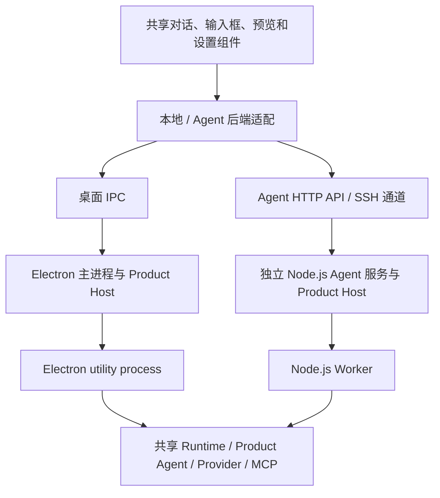

# 当前架构

本页描述主分支的当前实现，源码包版本为 `1.0.0-beta.5`，安装包可能尚未包含全部更新。历史迁移记录和分析报告不代替这里的运行边界；部署步骤见 [Agent 服务](AGENT_SERVICES.md)，发布步骤见[跨平台发布](CROSS_PLATFORM_RELEASE.md)。

## 三种执行方式

| 方式 | Agent 循环与模型请求 | 文件／命令执行位置 | 生命周期 |
| --- | --- | --- | --- |
| 本地会话 | 桌面托管的 Runtime | 本机工作区，或工具显式选择的已授权环境 | 随桌面应用运行 |
| SSH 项目 | 仍由桌面 Runtime 执行 | 通过 SSH/SFTP 访问所选远端目录；`environment: local` 仍指本机 | 桌面拥有连接和已知终端；断线不自动重放命令 |
| 独立 Agent 服务 | 服务器自己的 Runtime、模型配置和凭据 | Agent 主机及其可用工具环境 | 独立 Node.js 服务；桌面断开不停止已接收任务 |

SSH 项目无需远端 CardBush 服务。通过 SSH 接入独立 Agent 则是将 HTTP 请求和事件流交给 SSH 通道，连接远端回环地址的 Agent 服务；桌面不再建立本地监听转发端口。这两种方式可以共用保存的 SSH 连接，但不共用任务或配置所有权。

## 共享核心与宿主

图中的共享核心表示使用同一套代码，每个宿主仍拥有独立的运行时状态。

| 模块 | 职责与边界 |
| --- | --- |
| `packages/bush-protocol` | 命令、事件、会话和工具类型及校验；宿主与界面共享协议 |
| `packages/bush-runtime` | Agent 循环、回合状态、执行历史、权限、上下文维护和内置工具 |
| `packages/bush-product-agent` | 产品指令、用户时间快照、模型参数与回合请求构造；本地和远端共用 |
| `packages/cardbush-product-host` | 模型、插件、MCP、沙盒、维护等产品命令及配置存储；具体能力由宿主注入 |
| `packages/bush-provider-openai` | 按模型配置选择 Responses、Chat Completions 或 Anthropic Messages；请求投影、流式归一化、工具回放与供应商差异处理 |
| `packages/bush-mcp-client` | MCP 连接及工具／资源调用 |
| `packages/bush-runtime-electron` | 类型化 Runtime 客户端与传输适配；名称包含 Electron，但 Node Agent 也复用其协议实现 |
| `packages/cardbush-platform` | 系统能力、Shell 与原生程序解析；浏览器安全类型和 Node 实现分别导出 |
| `electron/runtimeHostController.mts`、`electron/runtimeHostWorker.mts` | 桌面 Runtime 生命周期与共享 worker 入口 |
| `electron/agentServiceCli.mts`、`electron/agentService.mts`、`electron/agentRuntimeHost.mts` | 独立服务入口、HTTP/队列管理和 Node Worker 宿主；运行时不启动 Electron |
| `electron/productHostController.mts` | 将共享产品命令接到当前宿主的设置、插件与维护实现 |
| `packages/bush-runtime/src/assistantConversation.ts`、`conversationJournal.ts` | 个人助手的持续交流、独立日志、受限工具及后台完成反馈 |
| `electron/realtimeVoiceService.ts`、`src/features/voice` | 实时 Provider 接入、应用级通话归属、音频和上下文衔接 |
| `src` | React 界面、会话状态消费、页面历史及本地／远端后端适配 |

不要因服务文件位于 `electron/` 就推断服务依赖桌面进程；以入口的实际依赖和宿主实现为准。反过来，也不能将完整桌面安装包当作 Agent 服务器发行物。

## 对话、设置和事实来源

本地与云 Agent 复用 `useCardbushChat`、`ChatPanel`、输入框和 Runtime 事件消费规则。`src/features/conversationHost.ts` 声明文件、附件、插件目录、工具详情等主机接口；远端实现从选定 Agent 读取。适配层负责传输与所属环境，避免另造消息列表、发送确认或图片读取流程。

- 服务先持久化收到的消息，再确认接收并交给队列执行。输入框按接收结果清理对应草稿；后来的草稿不应被前一轮完成事件清掉。
- 同一会话顺序执行，不同会话独立运行。发送请求 ID 用于去重；网络重试保留 ID 与内容，不能改成新的任务提交。
- SSE / NDJSON 事件带序号；重连补读与发送相互独立。取消订阅不等于取消任务，停止任务必须走显式停止操作。
- 工具开始、完成、失败以实际 Runtime 事件为准。简短的显示标题只是说明，不是执行事实；历史结果和归档 locator 不代表新执行。
- 页面前进后退保存访问位置，不保存凭据、草稿或执行结果。后台流式更新不产生新页面历史。
- 页面内的「返回市场／返回管理」按当前应用路由和视图层级定位父页面，不调用无条件的全局后退；历史已淘汰时仍在当前路由返回父页面。窗口前进后退继续按访问顺序工作。

设置页面通过环境适配选择本机或 Agent 的 Product Host。模型、插件、MCP、全局指令和沙盒设置属于所选主机；主题、语言、字体、快捷键及显示偏好属于桌面。新能力通过服务声明的 capability 判断，不能向旧服务无条件发送新字段。

模型连接使用明确的 `apiProtocol` 和自定义请求头。Provider binding 按协议和连接参数生成不可变修订；对话 ID 在每次请求时注入头部，避免并发会话互相覆盖。新增协议仍消费统一 `ModelRequest` 并产出 `ModelEvent`，不另建 Agent 循环。配置界面和传输约定见[模型接入](MODEL_CONNECTIONS.md)。

`ModelProviderRegistry` 只选择请求适配器。Responses、Chat Completions、Messages 分别投影消息与解析流，公共输入处理和工具身份映射不依赖任何具体协议。适配器不能执行工具、修改权威历史或决定下一轮；`executeModelRound` 汇总统一事件，`InMemoryRuntimeHost` 处理执行、权限、重试、停止、压缩和恢复。供应商签名思考等数据以不透明 replay 携带，不能成为另一套 loop 状态。

## 个人助手与应用级语音

个人助手采用固定的 `personal-assistant` 会话身份。`ConversationJournal` 追加页面内容、内部转写、任务回执和摘要，与普通执行会话的 `SessionStore` / Turn 日志分开；语音追加不占用正在执行的文字 Turn 序号。条目以消息 ID 幂等追加，重置增加上下文代次，旧通话与旧请求不能迟到写入新上下文。界面按显式的 `source` 和 `visibility` 显示记录，不解析正文推断是否该展示。

助手文字交流通过 `AssistantConversation` 与公共 `executeModelRound` 接入所选模型，只提供派发、即时状态、主子消息、分页读取和 `page_write`。普通实时语音提供前四类入口，assistant 通话另提供 `page_write`。真正的执行由 `RealtimeAgentDispatcher` 接到既有子 Agent 调度、工具注册表、权限和持久化执行循环；交流父会话不会直接运行文件或终端工具。任务完成通过真实状态异步反馈，页面以任务气泡打开共用执行详情。

交流和语音采集属于桌面；assistant 的执行主机选择只作用于后续派发。远端子任务使用目标 Agent 服务自己的配置和工作区，追加、读取与恢复按任务保存的原主机路由。附件保留本机预览引用，远程执行另走分块上传并记录目标路径。配置同步和任务提交是不同动作；任务派发本身不复制桌面 OAuth 凭据或整个父会话。

`applicationVoiceSession` 持有通话的麦克风、播放、归属和执行桥。导航、设置页和最小化不重定向通话；控件在所属输入框与浮动胶囊间切换。录音则绑定可见页面，离开后释放采集并取消未提交转写。挂断与取消任务分开，本地执行依赖桌面生命周期，独立服务继续拥有已接收的任务。

语音 Provider 与文字 Provider 使用不同连接配置。`realtimeVoiceProvider.ts` 归一化音频、上下文、工具回执和控制事件；服务层负责调用去重、背压、恢复与空隙通知。实时通话维护使用所选文字模型的独立压缩请求，冻结范围后保存摘要，确认远端新历史后再替换旧上下文；无法确认时重建连接，不重放执行工具。用于语音恢复的 `voice-history` 转写和摘要由系统安全存储加密，会话日志另按 JSONL 保存；原始通话音频不归档。这些会话摘要与跨会话习惯记忆分开。

用户操作、主机边界与重置范围见[个人助手](PERSONAL_ASSISTANT.md)，协议和上下文维护见[实时通话](REALTIME_VOICE.md)，原有识别／Agent／朗读模式见[本地语音](LOCAL_VOICE_MODELS.md)。

## 插件、应用中心与引用

插件提供技能、MCP 工具或运行时扩展。安装、配置、启用和更新都在选定环境执行。独立 Agent 可使用自己的插件市场，也可按连接设置同步选定插件、配置及已保存的模型／MCP 凭据；同步规则见 [Agent 服务](AGENT_SERVICES.md)。浏览器登录状态、ChatGPT / SIWC OAuth 凭据、插件目录外数据和桌面原生组件不迁移；远端不能提供本机浏览器登录弹窗或直接加载原生 renderer。

应用中心是可操作页面和快捷入口目录：内置页面、用户添加的应用／网址，以及插件明确声明的 `cardbush.applications`。普通 `.app.json` MCP 连接不是应用页面，仍由插件设置管理。

`@` 应用引用只为当前用户消息提供名称、类型和入口信息；不安装工具、不授予权限、不证明应用已经执行。由 MCP 工具结果生成的交互页面通过真实结果的 App 引用打开，不应在运行循环中自行弹出。详见[应用中心约定](../assets/skills/cardbush-docs/references/app-center.md)与[插件兼容性](PLUGIN_COMPATIBILITY.md)。

引用身份与资源地址分开解析。Markdown 链接与媒体嵌入共用 `MarkdownReference`：Source 始终是来源注释，File Memo 先解析文件记录，App 与 `@` 引用保留各自入口。即使模型把 Source 写成图片语法，也只显示来源注释；不能把引用 ID 当作文件名，或猜测它是图片、音频或视频。

助手正文中的裸 Source 编号（如 `[21]`）可在显示时恢复为来源入口：界面向当前宿主批量查询，只有同一会话、同一回合成功保存的来源记录才能返回完整引用身份。未知编号保持原文，代码、转义文本、已有链接和用户消息不自动转换。查询只读已保存记录，不调用模型、不读取证据文件，也不改写历史消息；缓存按宿主和回合隔离。

图片、音视频、文件附件与预览共用 `localPaths` 的资源地址分类。本地文件、SSH 文件、网络地址及内联数据各走对应通道；相对文件必须先结合已知工作区解析，未知协议显示不可用。Electron 文件读取与预览接口再通过 `localResourcePath` 验证绝对路径，禁止把引用 ID、网页地址或预览路由拼接到进程工作目录后读取。错误展示不改写历史消息，也不触发模型重试。

## 权限与隔离

界面提供「申请批准／完全访问」，命令沙盒另由宿主设置管理。默认 `auto` 策略在申请批准模式下使用可用沙盒，完全访问使用普通进程；管理员指定的 `required` 不会被会话参数或子 Agent 关闭。

Windows 使用 AppContainer，Linux 使用 bubblewrap。Linux 安装检测基于可信可执行文件、包管理器和实际运行能力，覆盖 Debian、Red Hat、Arch 及其他可识别的派生环境，而非发行版名称白名单。界面先检测，用户点击后才安装；检测不到安装方式时保留不可用原因。

命令沙盒与 Chromium 沙箱、路径审批、MCP 或插件权限是不同边界。Linux 暂无额外 seccomp 过滤，也没有 Windows Job Objects 对等的 CPU／内存限制。普通 SSH 命令不能凭桌面沙盒设置获得远端操作系统隔离。具体约束见[权限](PERMISSIONS.md)、[命令沙盒](EXECUTION_SANDBOX.md)和[进程资源](PROCESS_RESOURCE_PROTECTION.md)。

## 数据与更新

桌面数据位于 Electron 用户数据目录；独立服务使用 `--data-dir`。每个服务数据目录只允许一个进程拥有，访问令牌代表整个实例的管理权限，当前不提供多租户权限划分或共享目录多副本部署。

更新桌面不更新远端 Agent。更新服务需要保留实例 ID、令牌、配置、会话、插件、市场来源和技能资源，并等待正在执行的工作安全结束。队列可恢复；服务中断时正在执行的任务不会自动重放。内置服务技能位于数据目录的 `bundled/skills`，需随服务版本单独同步，不能覆盖用户的 `skills`。

修改共享协议、运行时或产品命令时，同时验证本地和 Agent 适配；修改系统专属行为时运行对应平台测试。发布时同步版本、双语 README、当前架构／功能文档和发布说明，再由同一标签构建两平台安装包。历史发布说明保留当时事实，不随新架构改写。
